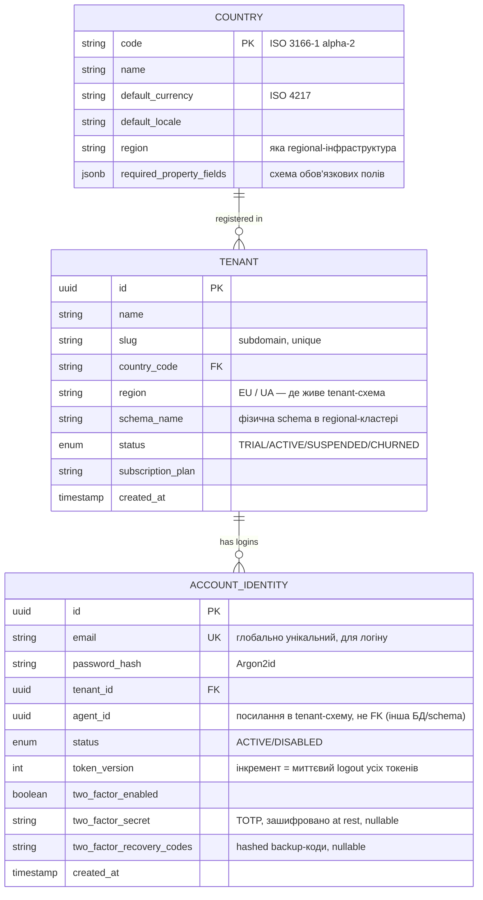
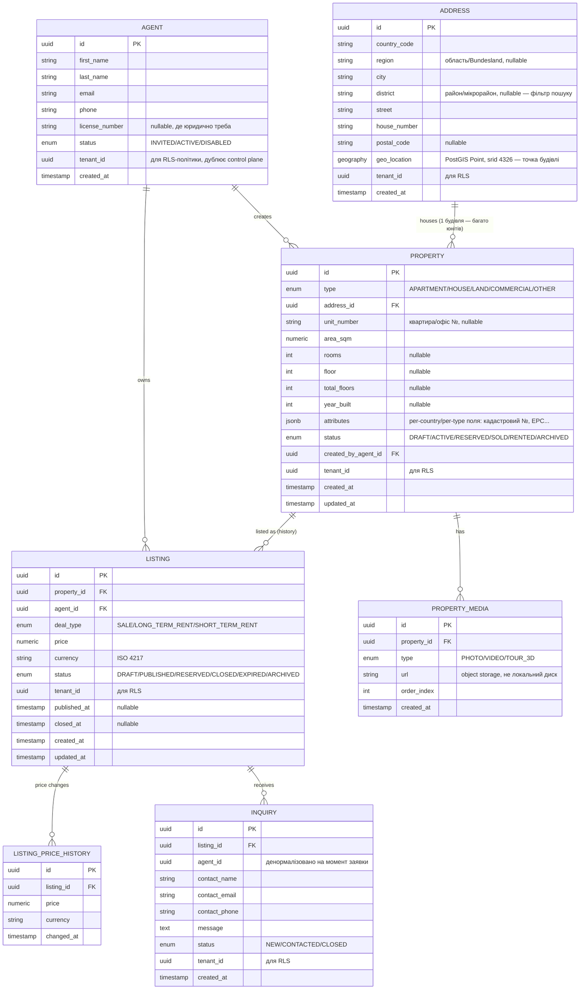

# Memphisreo — доменна модель Фази 1

*Статус: чернетка v0.1, дата: 2026-08-15. Доповнює [business-plan.md](business-plan.md)
та [architecture.md](architecture.md).*

Модель розділена на дві площини відповідно до architecture.md §3:
**control plane** (спільна схема, знає про всіх tenant-ів) і **tenant
plane** (schema-per-tenant, повторюється для кожної агенції).

## 1. Control plane



**Навіщо `ACCOUNT_IDENTITY` окремо від `AGENT`:** логін відбувається до
того, як відомо, у чиїй tenant-схемі шукати профіль (email → tenant_id —
саме ця резолюція описана в architecture.md §3 "Резолюція tenant з
запиту"). Профіль агента (ім'я, ліцензія) лишається в tenant-схемі разом
з рештою його даних; **ролі й дозволи агента — окрема RBAC-модель**,
див. [security.md §3](security.md).

## 2. Tenant plane (повторюється в кожній tenant-схемі)



Ролі й дозволи агента (`ROLE`, `ROLE_PERMISSION`, `AGENT_ROLE`) —
винесені в окрему RBAC-модель, конфігуровану онлайн через адмінку, не
фіксований enum на `AGENT`. Повна схема — [security.md §3](security.md).

## 3. Ключові рішення моделі

- **`Property` ≠ `Listing`** (обґрунтовано в business-plan.md §4): об'єкт
  може мати кілька лістингів за свою історію (перевиставлення, зміна
  умов) без втрати ідентичності. `LISTING_PRICE_HISTORY` фіксує зміни
  ціни всередині одного лістингу окремо від цього.
- **`attributes` (JSONB) на `PROPERTY`** — саме тут реалізується
  per-country варіативність полів із business-plan.md §2: `COUNTRY.
  required_property_fields` описує, які ключі обов'язкові для конкретної
  країни, застосунок валідує `PROPERTY.attributes` проти цієї схеми на
  рівні сервісу (не на рівні БД).
- **`ADDRESS` окрема сутність, `geo_location` живе на ній, не на
  `PROPERTY`** — головний кейс: новобудова, де десятки-сотні юнітів
  (`PROPERTY`) фізично в одній будівлі. Без виносу адреси довелось би
  дублювати (і ризикувати розсинхронізувати) ту саму адресу й координати
  на кожному юніті. `PROPERTY.address_id` + `PROPERTY.unit_number`
  (квартира/офіс у межах будівлі) покриває це. Обґрунтування вибору
  PostGIS — architecture.md §6.
- **Пошук "поруч зі школою/метро" — це гео-відстань, не збіг адресних
  полів.** Коли з'явиться `PointOfInterest`-подібна сутність (Фаза 2+,
  поза скоупом цього документа), вона так само матиме власний
  `geo_location`, і запит буде `ST_DWithin(address.geo_location,
  poi.geo_location, radius)`. Збіг за вулицею/районом свідомо не
  використовується як механізм "поруч" — довга вулиця чи різні боки
  перехрестя дають хибні результати порівняно з точною відстанню.
- **`tenant_id` присутній навіть у tenant-схемі**, попри те, що ізоляція
  вже забезпечена самою схемою — це навмисна надлишковість під Row-Level
  Security як другий рубіж захисту (architecture.md §6), а не помилка
  дизайну.
- **`INQUIRY` — мінімальна форма Фази 1**, свідомо без статусної машини
  угоди й без прив'язки до окремого `Client`-агрегату: повноцінний CRM
  (`Client`/`Lead` з business-plan.md §4) — Фаза 2. `INQUIRY` тут — це
  сирий вхідний сигнал "хтось лишив заявку", логіка Фази 2 буде
  перетворювати його на `Lead`.
- **Чого свідомо немає в Фазі 1:** оплат/білінгу (`TENANT.
  subscription_plan` — просто поле-мітка, без логіки нарахувань),
  месенджера, збереженого пошуку/обраного користувача — усе за скоупом
  Фази 1 з business-plan.md §7.

## 4. Рішення: формат `COUNTRY.required_property_fields`

**JSON Schema** (json-schema.org), не власний DSL.

Причина: готові Java-бібліотеки валідації (не пишемо й не підтримуємо
власний парсер/валідатор роками), той самий формат можна віддати
фронтенду для валідації форми без дублювання правил у двох місцях,
відомий industry-standard — не треба навчати нових розробників власному
формату.

Мінус "немає UI-підказок (label, порядок поля)" з коробки закривається
офіційно дозволеними спецом `x-`-розширеннями, без відходу від стандарту:

```json
{
  "type": "object",
  "properties": {
    "energy_certificate": {
      "type": "string",
      "enum": ["A", "B", "C", "D", "E", "F", "G"],
      "x-label-uk": "Клас енергоефективності",
      "x-ui-order": 3
    }
  },
  "required": ["energy_certificate"]
}
```

**Рішення:** редагування — через окрему адмін-форму поверх схеми, не
напряму в JSON. Мотивація — зміни (нова країна, нове обов'язкове поле)
мають діяти "на гарячу", без редеплою; оскільки `required_property_fields`
вже зберігається в БД (control plane, JSONB), адмін-форма — це UI-шар,
що робить `UPDATE` цього рядка, змін в архітектурі це не вимагає. Коли
саме будувати цю форму (Фаза 1 чи пізніше) — не вирішено, перші кілька
країн можна завести напряму в БД без UI.

## 5. Інші відкриті питання моделі

- Видалення tenant-а (GDPR right to erasure, architecture.md §5 control
  plane) — при schema-per-tenant це `DROP SCHEMA`, але потребує процесу
  підтвердження/затримки перед фізичним видаленням — не спроєктовано.
