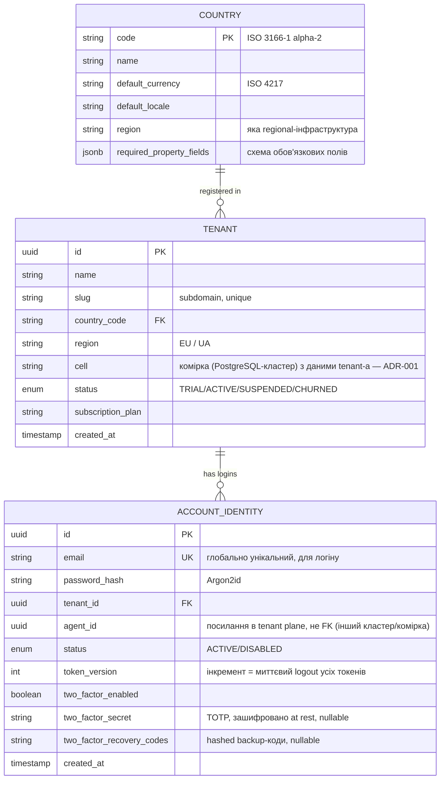
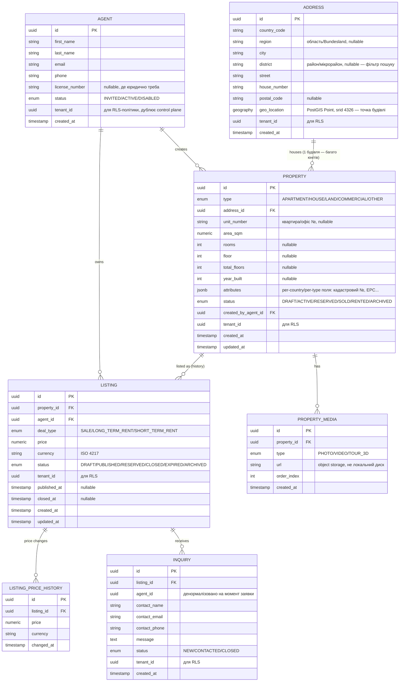
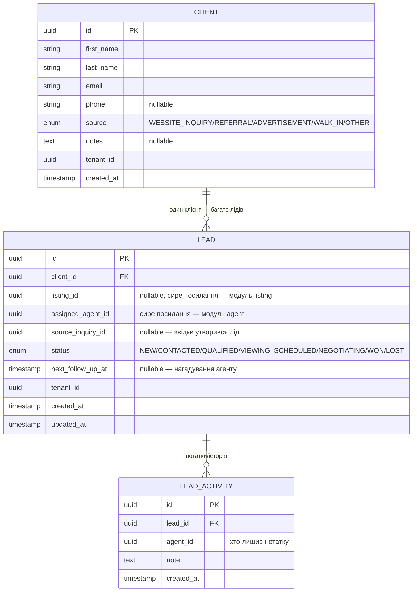
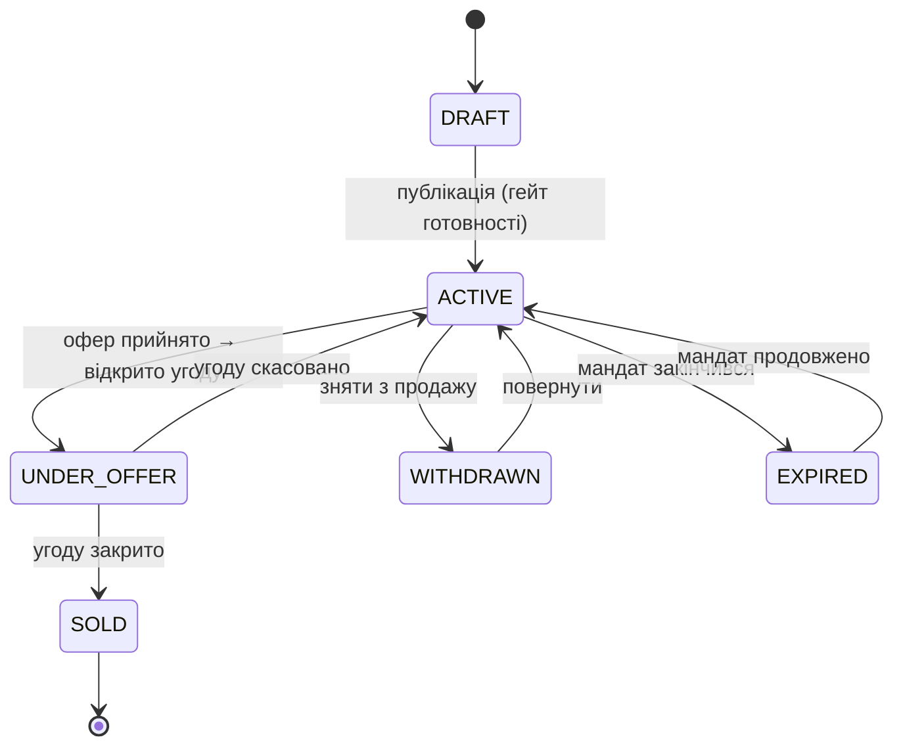
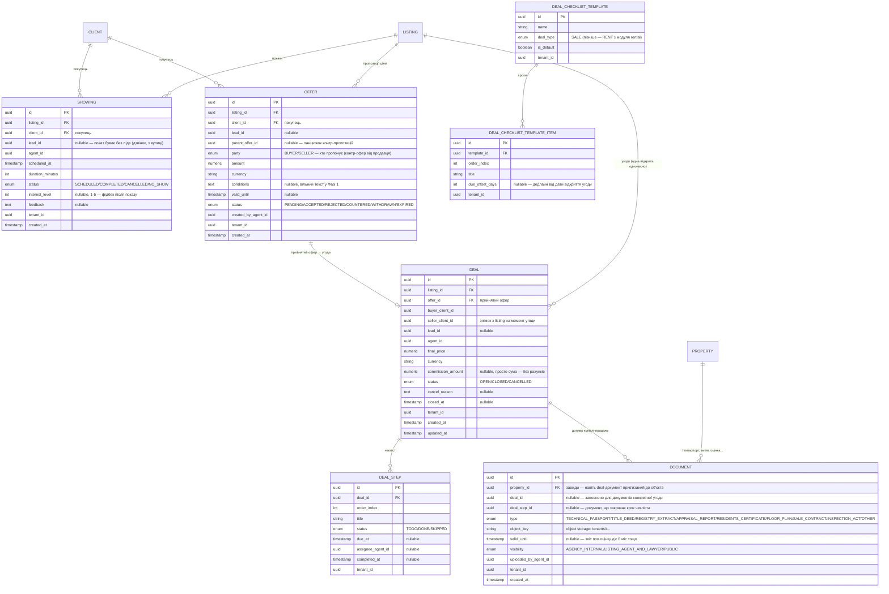

# Memphisreo — доменна модель

*Статус: чернетка v0.2, оновлено 2026-10-05 (ADR-001, скоуп Фази 1 — §6).
Перша версія — 2026-08-15. Доповнює [business-plan.md](business-plan.md)
та [architecture.md](architecture.md).*

Модель розділена на дві площини відповідно до architecture.md §3:
**control plane** (спільна схема, знає про всіх tenant-ів) і **tenant
plane** (спільні таблиці з `tenant_id` під RLS — [ADR-001](adr/001-shared-schema-rls-cells.md)).

> Заголовок §5 "Фаза 2" історичний. Актуальний поділ на фази —
> business-plan.md §7: CRM-ядро (§5) і воркфлоу продажу (§6) входять у Фазу 1.

## 1. Control plane



**Навіщо `ACCOUNT_IDENTITY` окремо від `AGENT`:** логін відбувається до
того, як відомо, якого tenant-а (і яку комірку) обслуговує запит (email → tenant_id —
саме ця резолюція описана в architecture.md §3 "Резолюція tenant з
запиту"). Профіль агента (ім'я, ліцензія) лишається в tenant plane разом
з рештою його даних; **ролі й дозволи агента — окрема RBAC-модель**,
див. [security.md §3](security.md).

## 2. Tenant plane (спільні таблиці з `tenant_id`, RLS)



Ролі й дозволи агента (`ROLE`, `ROLE_PERMISSION`, `AGENT_ROLE`) —
винесені в окрему RBAC-модель, конфігуровану онлайн через адмінку, не
фіксований enum на `AGENT`. Повна схема — [security.md §3](security.md).

## 3. Ключові рішення моделі

- **`Property` ≠ `Listing`** (обґрунтовано в business-plan.md §4): об'єкт
  може мати кілька лістингів за свою історію (перевиставлення, зміна
  умов) без втрати ідентичності. `LISTING_PRICE_HISTORY` фіксує зміни
  ціни всередині одного лістингу окремо від цього.
- **`attributes` (JSONB) на `PROPERTY`** — саме тут реалізується
  per-country варіативність полів із business-plan.md §2: `COUNTRY.
  required_property_fields` описує, які ключі обов'язкові для конкретної
  країни, застосунок валідує `PROPERTY.attributes` проти цієї схеми на
  рівні сервісу (не на рівні БД).
- **`ADDRESS` окрема сутність, `geo_location` живе на ній, не на
  `PROPERTY`** — головний кейс: новобудова, де десятки-сотні юнітів
  (`PROPERTY`) фізично в одній будівлі. Без виносу адреси довелось би
  дублювати (і ризикувати розсинхронізувати) ту саму адресу й координати
  на кожному юніті. `PROPERTY.address_id` + `PROPERTY.unit_number`
  (квартира/офіс у межах будівлі) покриває це. Обґрунтування вибору
  PostGIS — architecture.md §6.
- **Пошук "поруч зі школою/метро" — це гео-відстань, не збіг адресних
  полів.** Коли з'явиться `PointOfInterest`-подібна сутність (Фаза 2+,
  поза скоупом цього документа), вона так само матиме власний
  `geo_location`, і запит буде `ST_DWithin(address.geo_location,
  poi.geo_location, radius)`. Збіг за вулицею/районом свідомо не
  використовується як механізм "поруч" — довга вулиця чи різні боки
  перехрестя дають хибні результати порівняно з точною відстанню.
- **`tenant_id` — у кожній tenant-scoped таблиці, частина первинного
  ключа `(tenant_id, id)` і всіх FK.** Основа RLS-ізоляції й захист від
  посилань на чужі записи (ADR-001). На ER-діаграмах для стислості
  показано лише `id`.
- **`INQUIRY` — мінімальна форма Фази 1**, свідомо без статусної машини
  угоди й без прив'язки до окремого `Client`-агрегату: повноцінний CRM
  (`Client`/`Lead` з business-plan.md §4) — Фаза 2. `INQUIRY` тут — це
  сирий вхідний сигнал "хтось лишив заявку", логіка Фази 2 буде
  перетворювати його на `Lead`.
- **Чого свідомо немає в Фазі 1:** оплат/білінгу (`TENANT.
  subscription_plan` — просто поле-мітка, без логіки нарахувань),
  месенджера, збереженого пошуку/обраного користувача — усе за скоупом
  Фази 1 з business-plan.md §7.

## 4. Рішення: формат property-схеми (уточнено в §6.7)

**JSON Schema** (json-schema.org), не власний DSL.

Причина: готові Java-бібліотеки валідації (не пишемо й не підтримуємо
власний парсер/валідатор роками), той самий формат можна віддати
фронтенду для валідації форми без дублювання правил у двох місцях,
відомий industry-standard — не треба навчати нових розробників власному
формату.

Мінус "немає UI-підказок (label, порядок поля)" з коробки закривається
офіційно дозволеними спецом `x-`-розширеннями, без відходу від стандарту:

```json
{
  "type": "object",
  "properties": {
    "energy_certificate": {
      "type": "string",
      "enum": ["A", "B", "C", "D", "E", "F", "G"],
      "x-label-uk": "Клас енергоефективності",
      "x-ui-order": 3
    }
  },
  "required": ["energy_certificate"]
}
```

**Рішення:** редагування — через окрему адмін-форму поверх схеми, не
напряму в JSON. Мотивація — зміни (нова країна, нове обов'язкове поле)
мають діяти "на гарячу", без редеплою; адмін-форма — це UI-шар, що
робить `UPDATE` рядка в БД, змін в архітектурі це не вимагає.

**Уточнено в §6.7: ключ схеми — не сама країна, а пара
(country, propertyType).** Квартира й будинок у тій самій країні мають
різні обов'язкові поля — одна схема на країну цього не покриває.

## 5. Фаза 2 — CRM (Client, Lead)

`Inquiry` із Фази 1 (§3) був навмисно "сирим сигналом" без статусної
машини — саме тут це переростає у повноцінний CRM.



**`Client` не має власного публічного API створення** — заводиться лише
як побічний ефект конвертації `Inquiry` → `Lead` (dedup за email у межах
tenant). Свідоме звуження скоупу: окремий "додати клієнта вручну" —
не Фаза 2 MVP, легко додати пізніше без зміни моделі.

**`Inquiry` отримує `converted_to_lead_id` (nullable)** — захист від
подвійної конвертації одного inquiry в кілька лідів. Модуль `inquiry`
у Фазі 1 мав лише сутність без repository/service/controller — Фаза 2
добудовує це як передумову для конвертації.

**Чому `LEAD_ACTIVITY` окремою таблицею, а не полем `notes` на `LEAD`:**
CRM без історії "хто і коли що написав" — це занотована, не CRM;
вартість окремої таблиці тут мінімальна порівняно з втратою history.

### Зміни для Фази 1 (2026-10-05)

- **`Client` — універсальний контакт** (покупець і продавець — роль у
  контексті, не тип запису): продавець — через `LISTING.seller_client_id`,
  покупець — через `SHOWING`/`OFFER`/`DEAL`. Один контакт може бути
  обома (продає одну квартиру, купує іншу).
- **Ручне створення контакту** — так, у Фазі 1 (агент заводить продавця
  з дзвінка; "тільки з inquiry" недостатньо). Dedup — за email або
  телефоном у межах tenant-а; email стає nullable.
- `TenantMaintenanceRunner` (донаганяв міграції по tenant-схемах) після
  ADR-001 не потрібен: міграції одні на комірку, а нові permission-и
  вбудованим ролям додаються міграцією даних, **тільки додаючи**.

## 6. Воркфлоу продажу: лістинг → покази → офери → угода (Фаза 1)

Дослідження зовнішніх джерел (RESO Data Dictionary, стандартний
real-estate closing workflow, перелік документів для продажу нерухомості
в Україні) показало: `Lead.status`, що закінчується на `WON`/`LOST`,
покриває лише "лід → кваліфікація". Реальний процес продовжується
показом, офером, торгом, договором і реєстрацією прав.

**Скоуп Фази 1 — базовий рівень, без глибини під конкретну країну чи
клієнта.** Усе, що залежить від процесу конкретної агенції, —
конфігурація (шаблон чекліста), не код. Поза Фазою 1: синхронізація
календарів, SMS/email-нагадування, структуровані умови оферу,
е-підпис/Дія, шаблони договорів, рахунки й платежі.

### 6.0 Життєвий цикл лістингу

Комерційний стан живе на `LISTING`, не на `PROPERTY`: той самий об'єкт
може бути проданий, а згодом виставлений знову (новий власник, новий
лістинг). `PROPERTY.status` спрощується до `ACTIVE/ARCHIVED` (стан
картки фізичного об'єкта).



- **Гейт готовності `DRAFT → ACTIVE`** (перевіряє сервіс, порушення
  повертаються списком): обов'язкові поля за JSON Schema (country, type),
  ціна, продавець, мінімум N фото (N — налаштування агенції, дефолт 5),
  заповнені поля мандату. Окремого стану `READY` немає — без процесу
  погодження менеджером він нічого не додає; з'явиться, якщо агенції
  попросять review перед публікацією.
- **Мандат (договір з продавцем) — поля на `LISTING`**, не окрема сутність
  у Фазі 1: `mandate_type` (EXCLUSIVE/NON_EXCLUSIVE), `mandate_valid_until`,
  `commission_percent` або `commission_fixed`. `ACTIVE → EXPIRED` —
  щоденний scheduled job.
- Кожен перехід — метод сервісу з перевіркою допустимості й записом у
  таймлайн (§6.4); жодних тригерів у БД.



Нові поля на `LISTING`: `seller_client_id`, `mandate_type`,
`mandate_valid_until`, `commission_percent`, `commission_fixed`; статуси
`DRAFT/ACTIVE/UNDER_OFFER/SOLD/WITHDRAWN/EXPIRED`.

### 6.1 Покази

- Перевірка накладки: агент не може мати два `SCHEDULED`-покази, що
  перетинаються за часом (попередження, не жорстка заборона — агент
  може свідомо поставити підряд).
- Показ можливий лише для лістингу в `ACTIVE` або `UNDER_OFFER`
  (резервний покупець).
- Подання: календар агента (день/тиждень) і список показів на картці
  лістингу з фідбеком — це і є матеріал для звіту продавцю.

### 6.2 Офери

- Контр-офер = новий `OFFER` з `parent_offer_id` і протилежним `party`;
  батьківський → `COUNTERED`. Ланцюжок читається як історія торгу.
- **Прийняття оферу** (`→ ACCEPTED`) атомарно: створює `DEAL` (`OPEN`)
  з чеклістом із шаблону, переводить лістинг в `UNDER_OFFER`.
- **Одна відкрита угода на лістинг.** Поки вона є, інші `PENDING`-офери
  лишаються як резервні, але прийняти їх не можна. Угоду скасовано →
  лістинг знову `ACTIVE`, резервні офери можна приймати.
- `valid_until` у минулому → `EXPIRED` (той самий щоденний job, що й мандати).

### 6.3 Угода і чекліст

- **Етапи угоди — кроки чекліста, а не статуси в enum.** Процес закриття
  різний у кожній країні (нотаріус в Україні, notaire+compromis у
  Франції, conveyancing у Великій Британії) і в кожній агенції. Статус
  угоди лише `OPEN/CLOSED/CANCELLED`; що відбувається всередині — кроки.
- **Шаблон чекліста — на рівні агенції**, засівається при реєстрації
  з дефолту країни. Дефолт для UA: завдаток / попередній договір →
  перевірка правовстановчих документів і витягу з ДРРП → звіт про оцінку
  → призначення нотаріуса → підписання договору купівлі-продажу →
  розрахунок → реєстрація права власності → передача ключів і акт.
- **При відкритті угоди кроки копіюються** з шаблону в `DEAL_STEP`
  (знімок): зміна шаблону не ламає угод, що вже тривають; агент може
  додати/пропустити крок у конкретній угоді.
- Закриття (`→ CLOSED`) — лише коли всі кроки `DONE` або `SKIPPED`;
  лістинг → `SOLD`. Скасування (`→ CANCELLED`) вимагає причини; лістинг →
  `ACTIVE`, прийнятий офер → `WITHDRAWN`.
- Модуль `rental` пізніше принесе власні шаблони (`deal_type = RENT`) —
  механізм той самий.

### 6.4 Таймлайн і задачі

- **`ACTIVITY_EVENT`** — append-only стрічка подій: `(tenant_id,
  subject_type, subject_id, type, payload jsonb, actor_agent_id,
  created_at)`, `subject_type` ∈ PROPERTY/LISTING/CLIENT/DEAL. Пишуть
  сервіси при кожній зміні стану (створено, змінено ціну, показ,
  офер, крок угоди…). Картка лістингу й контакту показує стрічку;
  заодно це аудит "хто і коли". `LEAD_ACTIVITY` (нотатки) лишається.
- **`TASK`** — внутрішня задача з дедлайном: `(tenant_id, title, due_at,
  assignee_agent_id, subject_type, subject_id, status OPEN/DONE)`.
  Нагадування — лише в застосунку (список "мої задачі на сьогодні");
  email/push — коли з'явиться інфраструктура сповіщень.

### 6.5 Документи

**`DOCUMENT.type` — не абстракція, а конкретний перелік з українського
законодавства**, знайдений дослідженням: технічний паспорт,
правовстановлюючий документ, витяг з Державного реєстру речових прав,
звіт про оцінку, довідка про зареєстрованих осіб — плюс технічні
(floor plan) і транзакційні (сам договір купівлі-продажу).

**`DOCUMENT.visibility` замикає ідею з бізнес-плану** ("правовстановлюючі
документи бачить лише лістер + юрист агенції") **без нового механізму
RBAC** — досить нового permission-коду (напр. `DOCUMENT_VIEW_CONFIDENTIAL`),
призначюваного через уже існуючу систему кастомних ролей (security.md §3):
tenant admin створює роль "Юрист", видає їй цей permission, призначає
потрібному агенту. Перевірка на рівні сервісу: `agent == listing.agentId
|| hasAuthority(DOCUMENT_VIEW_CONFIDENTIAL)` — той самий патерн
"RBAC для типу дії, ownership-перевірка для конкретного екземпляра",
уже задокументований у security.md §3.

**`DOCUMENT.valid_until`** закриває ідею з нагадуваннями про
протермінування — сам механізм нагадувань (scheduled job + доставка)
не спроєктовано, це окрема інфраструктурна передумова (email/push),
якої ще немає.

### 6.6 Чому саме так

**Чому `Showing`/`Offer` окремі сутності, а не поля на `Lead`:** кілька
показів (повторний перегляд) і кілька пропозицій (торг) — це історія з
датами й статусами кожного запису, не один поточний стан. Той самий
принцип, що обґрунтував окрему `LEAD_ACTIVITY` замість поля `notes` (§5).

**Чому прив'язка до лістингу й покупця, а `lead_id` — опційний:**
агент часто показує об'єкт людині, яка подзвонила чи прийшла з вулиці,
і ліда в системі немає. Вимагати лід — змусити агента вести зайву
бюрократію або обходити систему.

**Чому `Deal` — окрема сутність, не просто `Lead.status = WON`:** угода
має власний життєвий цикл з датами й документами, що триває вже ПІСЛЯ
прийняття оферу. Змішування двох життєвих циклів в одному record — та
сама помилка, якої вже уникли з `Inquiry` vs `Lead`.

**Наслідок для `LISTING`:** `DEAL → CLOSED` ⇒ `LISTING → SOLD` —
оркеструється сервісом модуля `deal` через публічний API модуля
`listing`, не тригером у БД.

### 6.7 Property-конфігурація: тип, не тільки країна

Дослідження (RESO property types, ImmoScout24/Idealista field schemas)
підтвердило: квартира, будинок, земельна ділянка й комерція мають
принципово різні набори полів навіть у межах однієї країни. Ключ
`required_property_fields` (§4) міняється з `country_code` на пару
`(country_code, property_type)` — окрема таблиця `property_type_schema`
у control plane замість поля на `COUNTRY`.

**Частина полів переходить із `PROPERTY.attributes` (JSONB) у реальні
типізовані колонки** — не тому, що JSONB "гірший", а тому, що це саме
ті поля, за якими шукатимуть публічно (публічний пошук —
відкрите питання ще з Фази 1): `bedrooms`, `bathrooms`, `land_area_sqm`
(площа ділянки — окремо від `area_sqm`, площі будівлі), `has_elevator`,
`parking_spaces`. Range-запити ("від 2 спалень", "до $100k") по
типізованих nullable-колонках — простіше й швидше, ніж по JSONB, навіть
з GIN-індексом. Це узгоджується з тим, як сам RESO Data Dictionary
моделює `Property` — одна широка таблиця зі спільними колонками для
всіх типів, nullable там, де тип не застосовується, а не окрема
таблиця на кожен тип. Усе інше (юридичне, рідкісне, дуже
country/type-специфічне — матеріал стін, тип покрівлі, приєднання
комунікацій) лишається в `attributes` JSONB під схемою.

**Модульне розміщення:** `Showing`/`Offer`/`Deal` — окремий модуль
`deal`, не розширення `crm`: після рішення "лід опційний" центр цих
сутностей — лістинг і покупець, а не лід; крім того, `rental` пізніше
перевикористає механізм угоди й чекліста. `Document` —
власний модуль з першого дня: по-перше, заявлений масштаб
(шаблони, е-підпис у Фазі 2) виправдає межу дуже швидко; по-друге, кожна країна
матиме свій список обов'язкових типів документів, власну валідацію і,
можливо, парсинг завантажених файлів (витягувати деталі об'єкта з
техпаспорта при завантаженні) — це вже зараз досить власної логіки,
щоб не ховати її всередині `property`.

### 6.8 Пошук — крос-tenant індекс (відкладено разом з публічним порталом)

Публічний пошук по практично всіх полях, швидкий навіть при великій
кількості об'єктів — вимагає окремої, не tenant-scoped схеми `search`,
куди `ListingService` явно синхронізує дані при публікації лістингу.
Повний дизайн, обґрунтування вибору PostgreSQL замість Elasticsearch
на цьому етапі, і причина, чому це взагалі окрема проблема —
[architecture.md §8](architecture.md).

## 7. Інші відкриті питання моделі

- Видалення tenant-а (GDPR right to erasure) — фоновий job видалення за
  `tenant_id` + префікс в object storage (ADR-001, "Наслідки"); процес
  підтвердження/затримки перед фізичним видаленням — не спроєктовано.
