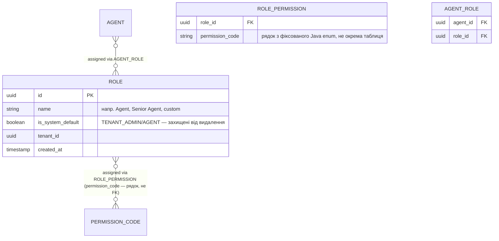

# Memphisreo — безпека та керування доступом

*Статус: чернетка v0.1, дата: 2026-08-16. Доповнює [architecture.md](architecture.md)
та [domain-model.md](domain-model.md).*

## 1. Принцип

Захист у кілька незалежних рубежів (defense in depth), кожен окремо:
tenant-ізоляція (schema-per-tenant + RLS, architecture.md §3), RBAC
(цей документ), і повна ізоляція платформного адміну від orbiти
tenant-користувачів (розділ 6). Права/ролі — дані в БД, редаговані
онлайн через адмінку, не хардкод у коді.

## 2. Дві незалежні системи ідентичності

- **`ACCOUNT_IDENTITY`** (control plane, вже в domain-model.md §1) —
  логін tenant-користувачів (агентів). Знає лише "цей email → цей
  tenant_id → цей agent_id".
- **`PLATFORM_STAFF`** (новий, control plane, окрема таблиця) — логін
  співробітників Memphisreo, які адмініструють саму платформу
  (модерація, керування tenant-ами, білінг платформи). **Свідомо не
  переюзаний `ACCOUNT_IDENTITY`** — окрема таблиця, окремий логін-ендпоїнт,
  окремий підпис JWT (розділ 6). Мета — щоб баг у tenant-авторизації не
  міг випадково дати доступ до платформного рівня.

## 3. RBAC-модель (tenant plane, конфігурується онлайн)

**Чому `PERMISSION` — Java enum, не таблиця в БД:** кожен permission
відповідає конкретній перевірці `@PreAuthorize` в коді — новий permission
неможливий без нового коду й деплою так само, як новий endpoint. Таблиця
в БД для цього означала б cross-schema FK з кожної tenant-схеми на
control plane (бо `PERMISSION` мав би бути глобальним) — зайва
крихкість заради каталогу, що й так змінюється лише разом з кодом. Адмінці
каталог віддається ендпоїнтом, що читає enum, не БД.

**Дві built-in роль на кожен новий tenant** (`is_system_default = true`,
незнищувані): `TENANT_ADMIN` (усі permissions) і `AGENT` (типовий робочий
набір: property/listing/inquiry/lead/client CRUD, без керування
агентами/ролями). Tenant admin може створювати власні ролі з підмножини
каталогу через адмінку — саме це і є "конфігурується онлайн".

**Каталог росте разом з фазами** (Фаза 2 додала `LEAD_VIEW`,
`LEAD_MANAGE`, `CLIENT_VIEW`, `CLIENT_MANAGE`). Оскільки built-in ролі
сіються один раз при онбордингу tenant-а, tenant-и, зареєстровані до
появи нового permission-коду, не отримають його автоматично — це
закрито `TenantMaintenanceRunner` (architecture.md §3): на старті
застосунку донараховує відсутні permission-и вбудованим ролям для
кожного вже існуючого tenant-а, **тільки додаючи**, не видаляючи те,
що tenant admin міг прибрати вручну кастомізацією ролі.

**RBAC відповідає на "чи може ця роль робити дію X", не на "чи може ЦЕЙ
агент редагувати ЦЕЙ КОНКРЕТНИЙ лістинг".** Друге — перевірка володіння
на рівні сервісу (`listing.agentId == currentAgentId || hasPermission
(LISTING_MANAGE_ALL)`), не RBAC. Змішувати ці дві перевірки в одну —
поширена помилка, яку варто уникнути свідомо.

## 4. Автентифікація — JWT, узгоджено зі stateless-вимогою

Узгоджено з architecture.md §4 (інстанси мають бути stateless для
горизонтального масштабування): сесія — в JWT, не в пам'яті процесу.

- **Access token** — короткоживучий (~15 хв), claims:
  `sub` (account_identity_id), `tenant_id`, `agent_id`, `permissions`
  (розгорнутий список кодів з усіх ролей агента на момент видачі),
  `token_version`.
- **Refresh token** — довгоживучий (~30 днів), httpOnly secure cookie
  (не localStorage — захист від крадіжки токена через XSS), окремий
  ендпоїнт обміну на новий access token; **при кожному обміні permissions
  перечитуються з БД заново** — саме тут зміна ролі/дозволів долітає до
  користувача, максимум за час життя access token.
- **Миттєвий відкликання (компрометований акаунт, звільнений агент):**
  колонка `ACCOUNT_IDENTITY.token_version` (int). Інкремент цього поля
  миттєво робить недійсними всі видані access token з меншим
  `token_version` — дешева індексована перевірка на кожен запит, без
  повного blocklist.

## 5. Двофакторна автентифікація (опціональна)

TOTP (RFC 6238, Google Authenticator/Authy-сумісний) — не SMS: без
залежності від SMS-шлюзу, без вразливості до SIM-swap, працює офлайн.

Додається на `ACCOUNT_IDENTITY`: `two_factor_enabled`,
`two_factor_secret` (зашифровано at rest), `two_factor_recovery_codes`
(hashed, одноразові backup-коди на випадок втрати пристрою).

Логін при увімкненому 2FA — два кроки: пароль → проміжний
короткоживучий "pending 2FA" токен (не access token) → код з
автентифікатора → повний access+refresh.

**Наперед закладено, не обов'язково для Фази 1:** `TENANT.
require_2fa_for_agents` (bool) — tenant admin вмикає обов'язковість 2FA
для всіх агентів своєї агенції; перевіряється при першому логіні
(агент змушений налаштувати 2FA перед продовженням).

## 6. Платформний адмін — окремий контур

- Окремий `SecurityFilterChain` (Spring Security підтримує кілька
  ланцюжків за URL-патерном), зматчений на `/platform-admin/**` або
  окремий піддомен.
- **Окремий ключ підпису JWT** для платформних токенів — витік
  tenant-ключа не дає підробити платформний токен, і навпаки.
- Аутентифікується проти `PLATFORM_STAFF`, не `ACCOUNT_IDENTITY` —
  фізично неможливо, щоб tenant-агент отримав платформні права через
  баг в одному спільному коді логіну, бо коду спільного немає.

## 7. Spring Security — реалізаційні нотатки

- Два `SecurityFilterChain` бін: tenant API (`/api/**`) і platform admin
  (`/platform-admin/**`), кожен зі своїм JWT-фільтром і ключем.
- Кастомний JWT-фільтр: валідує підпис і `token_version`, кладе
  `Authentication` з authorities = `permissions` з токена в
  `SecurityContext`, і окремо кладе `tenant_id` в `TenantContext`
  (ThreadLocal/request-scoped біт, який споживає `AbstractRoutingDataSource`
  з architecture.md §3).
- `@PreAuthorize("hasAuthority('LISTING_PUBLISH')")` на сервісних
  методах — по коду permission, байдуже, що ролі динамічні й
  tenant-специфічні: код перевіряє тільки фіксований каталог.
- `PasswordEncoder` — **Argon2id** (`Argon2PasswordEncoder`), не BCrypt:
  сучасна OWASP-рекомендація за замовчуванням для нових систем, дешевше
  прийняти зараз, ніж мігрувати хеші пізніше.
- Rate limiting на `/login` і `/2fa/verify` — потрібен захист від
  brute-force, конкретна реалізація (bucket4j чи на рівні
  інфраструктури/API gateway) — не деталізовано в цьому документі.

## 8. Критичне правило: tenant_id ніколи не з клієнта

`tenant_id`, що визначає, яку tenant-схему використовувати для запиту,
**береться виключно з підписаного JWT claim**, ніколи з query-параметра,
шляху чи тіла запиту, які контролює клієнт. Порушення цього правила —
пряма IDOR/tenant-confusion вразливість (агент одного tenant підставляє
чужий tenant_id і бачить чужі дані). Це стосується кожного ендпоїнта без
винятку.

## 9. Запрошення агента (invite-флоу)

Немає email-інфраструктури — адмінка не вдає, що лист пішов, а показує
посилання-запрошення для ручної передачі (Slack/месенджер), чесно про
поточне обмеження.

`ACCOUNT_IDENTITY` отримує `invite_token` (nullable, унікальний
частковий індекс), `invite_expires_at` (nullable), і новий статус
`PENDING_INVITE` (окрім `ACTIVE`/`DISABLED`) — `password_hash` теж стає
nullable до моменту прийняття запрошення.

Флоу:
1. `POST /api/agents/invite` (`AGENT_INVITE`) — створює `Agent`
   (`status=INVITED`, tenant-схема) і `AccountIdentity`
   (`status=PENDING_INVITE`, `password_hash=null`, `invite_token`,
   `invite_expires_at=+7 днів`, control plane). Повертає посилання
   з токеном — адмін копіює й передає агенту вручну.
2. `POST /api/auth/accept-invite` (публічний) — за токеном (не
   протермінованим) встановлює `password_hash`, чистить токен,
   переводить `AccountIdentity.status → ACTIVE`, `Agent.status → ACTIVE`.
3. `LoginService` відхиляє логін, якщо `status != ACTIVE` — `PENDING_INVITE`
   так само блокується, як і `DISABLED`.

Крос-модульна оркестрація (Agent + AccountIdentity) — у platform-app,
не в жодному з доменних модулів, той самий принцип, що й
`TenantRegistrationService` (architecture.md §2).

## 10. Відкриті питання

- SSO/OAuth для enterprise-tenant-ів — поза скоупом зараз, можлива Фаза 3.
- Політика паролів (мінімальна довжина, перевірка проти витоку — напр.
  HaveIBeenPwned API) — не деталізовано.
- Аудит-лог зміни ролей/дозволів (хто кому яку роль видав і коли) —
  рекомендовано мати з міркувань безпеки, не спроєктовано детально.
